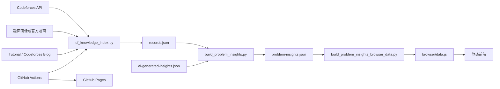

# CF补完计划项目约束

## 1. 项目定位

CF补完计划是一个面向 Codeforces 题目复习的静态知识页面，负责：

- 抓取比赛、题目元数据、可靠题面和题解正文；
- 为可用题面和题解生成中文题意、建模转换和关键观察摘要；
- 按比赛、知识点和难度浏览题目；
- 在浏览器本地绑定 Codeforces 账号，并标记本地账号已经通过的题目；
- 通过 GitHub Actions 定期增量更新源数据并发布 GitHub Pages。

线上页面：<https://fyrskd.github.io/>

源代码仓库：<https://github.com/Fyrskd/cf-knowledge>

页面仓库：<https://github.com/Fyrskd/Fyrskd.github.io>

本文件只约束 CF补完计划。仓库中的其他目录不属于本项目的运行链路，修改时不要把它们混入 CF 发布提交。

## 2. 总体流程



数据链路必须保持单向：抓取器产生原始事实，AI 只生成结构化摘要，构建脚本负责发布门和静态页面数据，前端不直接读取抓取原始正文。

## 3. 目录地图

只关注以下文件和目录：

```text
AGENTS.md
config.json                    # 可提交的公开默认配置
.github/workflows/cf-auto-update.yml
tools/
  cf_config.py                 # 公共、本机和旧版配置合并
  cf_knowledge_index.py       # Codeforces 抓取、题面校验、题解补抓
  cf_auto_update.py           # 定时任务编排入口
  cf_ai_manager.py            # AI 摘要管理和本地管理页
  test_cf_config.py           # 配置合并测试
  test_cf_knowledge_index.py  # 抓取器测试
  test_cf_auto_update.py      # 发布门和自动更新测试
  CF_KNOWLEDGE_INDEX.md       # 抓取器使用说明
  CF_AUTO_UPDATE.md           # 自动更新和上线说明
.
  records.json                # 抓取器产生的题目事实和来源证据
  problems.json               # Codeforces 题目元数据
  contests.json               # 比赛元数据
  editorials.json             # 去重后的题解博客元数据
  state.json                  # 断点续跑状态和失败记录
  ai-generated-insights.json  # 通过质量校验的 AI 摘要缓存
  problem-insights.json       # 发布用结构化数据
  problem-insights-browser/   # GitHub Pages 静态前端及 data.js
  build_problem_insights.py   # 从 records.json 构建发布数据
  build_problem_insights_browser_data.py # 生成浏览器 data.js
```

以下文件属于生成产物，不能把它们当成新的事实来源：

- `problem-insights.json`；
- `problem-insights-browser/data.js`；
- `problem-insights-by-problem.md`；
- `problem-insights-by-topic.md`；
- `problem-insights-quality-check.md`；
- 自动更新状态和缺口报告。

修改题面、题解或摘要逻辑时，应修改抓取器、AI 管理器或构建脚本，再重新生成产物。

## 4. 抓取器职责

入口是 `tools/cf_knowledge_index.py`。它负责：

1. 通过 Codeforces API 获取比赛和题目元数据；
2. 从题面镜像抓取题面，必要时回退到 Codeforces 官方题面页；
3. 校验抓到的内容确实是题面正文，不能把搜索结果、比赛元数据或导航页保存为题面；
4. 发现和抓取 Tutorial / Codeforces Blog；
5. 按题号切分共享博客，给每道题保存对应题解正文；
6. 将来源 URL、来源类型、质量、哈希和失败记录保存到 JSON；
7. 使用 `state.json` 断点续跑，网络失败在后续任务中重试。

常用命令：

```bash
cd /Users/welp/Haduki/cf-knowledge

# 抓取一个日期范围，并生成基础索引
python3 tools/cf_knowledge_index.py all \
  --since 2024-09-05 \
  --until 2026-09-22 \
  --out .

# 只抓比赛、题面和题解，不重建 Markdown 索引
python3 tools/cf_knowledge_index.py crawl \
  --since 2024-09-05 \
  --until 2026-09-22 \
  --out .

# 对已有数据补抓或修复不完整题解
python3 tools/cf_knowledge_index.py enrich \
  --data . \
  --only-incomplete \
  --skip-missing-contests

# 不联网，修复旧字段并重建基础索引
python3 tools/cf_knowledge_index.py reindex --data .
```

抓取器的事实来源优先级和校验逻辑必须保留。不能为了增加覆盖率而降低题面校验，也不能用模型猜测替代没有抓到的题解正文。

## 5. 原始数据约定

### 5.1 `records.json`

`records.json` 是构建发布数据时的主要事实来源。每条记录通常包含：

- `contest_id`、`contest_name`、`contest_date`、`index`、`title`、`rating`、`tags`；
- `problem_url`；
- `statement_text`、`statement_quality`、`statement_source`、`statement_source_url`；
- `editorial_url`、`editorial_text`、`editorial_status`、`editorial_quality`；
- 题解来源、抓取尝试和失败信息；
- 基于真实题面或题解文本得到的候选分类信息。

题面正文缺失或未通过题面校验时，该题不能进入最终页面。题面只允许来自抓取到的题面正文，不能从题目标题、标签或旧报告补写完整题意。

### 5.2 `ai-generated-insights.json`

该文件只保存 AI 生成且通过质量校验的结构化摘要。每条摘要必须绑定当前原始输入的 `input_hash`。原始题面、题解或标签发生变化后，旧摘要不能继续覆写新数据。

AI 摘要的内容包括：

- `statement_brief`：中文题意；
- `transformed_statement`：建模或等价转换；
- `key_observations`：关键观察列表；
- `solution_brief`：简要题解；
- `primary_topic`、`secondary_topics`；
- `extraction_status` 和质量标记。

不要把 API 返回的原始响应、未校验 JSON 或失败记录写成可发布摘要。

## 6. 发布门和数据语义

发布门位于 `build_problem_insights.py`，是 CF补完计划最重要的数据约束。

### 6.1 必须满足的条件

- 题面来源必须可靠，且 `statement_text` 通过题面校验；
- 题意摘要必须存在，不能是“待生成”或其他占位文本；
- 题解摘要只有在题解正文可用、摘要已生成且状态通过时才能发布；
- AI 输入哈希必须和当前 `records.json` 匹配；
- `pending_ai` 不能出现在最终发布数据中。

### 6.2 缺失内容的处理

- 没有可靠题面：整道题不发布；
- 有题面但题意摘要未就绪：整道题不发布；
- 没有可用题解正文：可以保留题面，但题解相关字段必须为空；
- 有题解正文但题解摘要未就绪：不发布题解内容，不能泄露占位文本、半成品转换或不可靠关键观察；
- AI 调用失败、质量检查失败或输入哈希过期：保持未完成状态，等待下一次生成或重试；
- 不能通过旧分析、训练报告、人工 review 或模型猜测填补缺失题面、题解和摘要。

最终前端只需要区分“有题解”和“无题解”。“无题解”表示题目仍有可发布题面，但没有可发布的题解摘要，不再展示内部抓取或 AI 阶段状态。

`problem-insights.json` 中的 `records` 是唯一发布集合；`summary.filtered_out_problems` 应等于原始记录数减去发布记录数。任何新增过滤逻辑都必须同步更新测试和工作流校验。

## 7. 摘要和静态页面构建

本地构建：

```bash
cd /Users/welp/Haduki/cf-knowledge

# 从 records.json 生成发布数据和检查报告
python3 build_problem_insights.py

# 从发布数据生成浏览器使用的 JavaScript 数据文件
python3 build_problem_insights_browser_data.py
```

`problem-insights-browser/data.js` 是 `window.CF_INSIGHTS_DATA = ...` 的静态数据文件，不要手工编辑其中的单题数据。

AI 管理器是本地 HTTP 管理页，默认只监听本机：

```bash
python3 tools/cf_ai_manager.py --host 127.0.0.1 --port 8787
```

自动更新脚本会直接调用管理器模块，不要求启动这个本地管理页。正式流水线使用严格模式：单题 AI 失败时保留该题为待处理并继续提交其他成功题目；如果本批次全部 AI 失败或缺少 key，任务才失败。

## 8. 前端约束

前端位于 `problem-insights-browser/`，由四个静态文件组成：

- `index.html`：页面结构和外部 KaTeX 资源；
- `app.js`：筛选、表格、详情、随机题目和账号同步逻辑；
- `data.js`：生成的发布数据；
- `styles.css`：页面样式。

当前正式页面提供：

- Contests 和 Topics 两种视图；
- 大知识点筛选；
- 手动填写的难度下限和上限，任意一侧留空表示不限制；
- “只看有题解”勾选框；
- 竞赛类型、排序和随机题目；
- 题目详情、原题链接、题解链接和竞赛链接；
- 浏览器本地账号绑定和通过记录同步。

账号功能边界：

- 只保存公开 Codeforces handle 和通过记录缓存；
- 数据保存在当前浏览器 `localStorage`，不写回仓库；
- 通过 Codeforces `user.status` API 读取公开提交记录；
- 账号同步失败不能影响题目数据展示；
- 不保存密码、Cookie、API token 或其他私密凭据。

页面文案、筛选语义和数据字段必须与 `app.js`、`data.js` 保持一致。不要在前端重新推断题解是否存在，应使用构建后的 `extractionStatus`。

## 9. 自动更新和上线

工作流是 `.github/workflows/cf-auto-update.yml`：

1. 默认每 6 小时运行一次，cron 为 `17 */6 * * *`；
2. 支持 `workflow_dispatch` 手动运行；
3. 使用最近一段重叠时间窗口抓取比赛；
4. 增量补抓题面和不完整题解；
5. 生成或刷新 AI 摘要；
6. 重建发布数据和浏览器 `data.js`；
7. 执行 Python 测试、JSON 检查、发布门检查、JavaScript 语法检查和 `git diff --check`；
8. 将源数据提交到 `Fyrskd/cf-knowledge`；
9. 将 `index.html`、`app.js`、`data.js`、`styles.css` 复制到 Pages 仓库根目录并推送。

自动更新总入口：

```bash
python3 tools/cf_auto_update.py \
  --lookback-days 30 \
  --ai-limit -1 \
  --require-ai
```

常用参数：

- `--lookback-days`：重叠抓取窗口，必须为正数；
- `--ai-limit -1`：处理全部待生成摘要；
- `--ai-limit 0`：跳过 AI，只适合本地调试，不能用于正式上线；
- `--refresh-ai`：按当前输入重新生成已有 AI 摘要；
- `--skip-editorial-enrich`：跳过题解补抓，仅在明确需要时使用；
- `--require-ai`：缺少 key 或本批次全部生成失败时拒绝提交；单题生成失败会记录警告并在下一轮重试，成功题目仍可发布。

源数据提交和 Pages 发布是连续但独立的步骤。Pages 推送失败时不能回滚已经提交的源数据，修复 token 或权限后重新运行发布流程即可。

## 10. Secrets 和本地配置

源仓库 GitHub Actions 需要：

- `OPENAI_API_KEY`：AI 摘要生成所需的 API key；
- `PAGES_DEPLOY_TOKEN`：对 `Fyrskd/Fyrskd.github.io` 具有 Contents Read and write 权限的 fine-grained token。

公开默认配置位于 `config.json`，本机覆盖位于被 `.gitignore` 忽略的 `config.local.json`。覆盖文件必须使用分组结构，例如：

```json
{
  "ai": {"model": "gpt-6-luna"},
  "crawler": {"timeout_seconds": 30}
}
```

AI 地址、模型、超时、抓取参数、自动更新参数、批量上传参数和 Pages 目标都应优先在配置文件中维护。API key 不写入 `config.json` 或提交内容；本地通过 `OPENAI_API_KEY` 提供，Actions 通过 `OPENAI_API_KEY` 和 `PAGES_DEPLOY_TOKEN` Secrets 提供。

配置文件合并优先级为 `config.local.json` > 旧版 `ai-config.local.json` > `config.json`，具体命令行参数再覆盖对应配置。`AI_BASE_URL`、`AI_MODEL`、`AI_TIMEOUT_SECONDS` 仅作为旧脚本的兼容覆盖，不应作为新的配置入口。`ai-config.local.json` 仍可读取旧版平铺 AI 配置，但新建或修改本机配置时必须使用 `config.local.json` 的嵌套 `ai` 分组。不要在日志、测试输出、提交信息或页面数据中打印 token。

## 11. 测试和上线前检查

修改抓取器、发布门、AI 管理器或前端后，在仓库根目录运行：

```bash
python3 -m unittest tools/test_cf_config.py tools/test_cf_knowledge_index.py tools/test_cf_auto_update.py tools/test_cf_batch_upload.py
python3 -m py_compile \
  tools/cf_config.py \
  tools/cf_knowledge_index.py \
  tools/cf_auto_update.py \
  tools/cf_ai_manager.py \
  build_problem_insights.py \
  build_problem_insights_browser_data.py
node --check problem-insights-browser/app.js
node --check problem-insights-browser/data.js
git diff --check
```

涉及生成数据时，还要确认：

- `problem-insights.json` 是合法 JSON；
- 发布数据不包含 `pending_ai`；
- 每条发布记录都有非空题意摘要；
- 没有题解摘要的记录不带题解内容；
- 发布题目都能在 `records.json` 找到；
- 没有把 Codeforces 搜索或元数据页面当成题面；
- `data.js` 已重新生成且前端 JavaScript 语法检查通过。

## 12. 修改规范

- 开始修改前先阅读相关实现和现有说明，事实不明确时先检查代码，不凭经验猜测；
- 采用 KISS，优先复用现有数据结构和函数，不新增没有必要的抽象；
- Python 新代码使用类型标注，保持现有静态类型风格；
- 手工编辑文件使用 `apply_patch`，不要用重置或强制覆盖方式抹掉他人改动；
- 不使用破坏性 Git 命令，除非用户明确要求；
- 不提交 API key、token、本地 AI 配置、缓存和临时测试数据；
- 抓取失败应保留失败证据并支持重试，不能静默删除已有可靠数据；
- 生成数据必须由对应脚本重建，不能只手改页面产物；
- 所有用户可见文案使用中文，项目名称统一为“CF补完计划”；
- 提交前检查 `git status`，确保没有把无关目录或临时文件混入 CF 提交。
- 每次完成功能修复、新功能或会影响运行结果的调整后，在相关测试和质量检查通过、确认差异只包含本次修改后，自动创建一次 Conventional Commit 并推送到当前远端分支，无需再次询问；纯文档修改、临时调试文件，以及用户明确要求不提交或不推送的情况除外；推送失败时必须保留本地提交并如实报告原因，不能伪称已上线。

## 13. 故障排查

### 题面缺口增加

检查 `statement-gaps.json`、`state.json` 和记录中的 `statement_source_attempts`。先确认源站或镜像可访问，再重跑 `crawl` 或自动更新，不要手写题面。

### 题解存在但页面显示无题解

检查：

1. `records.json` 的 `editorial_text` 是否为完整正文；
2. `editorial_quality` 是否为 `complete`；
3. `ai-generated-insights.json` 的 `input_hash` 是否匹配；
4. AI 摘要质量检查是否通过；
5. 是否重新运行了 `build_problem_insights.py` 和浏览器数据构建脚本。

题解正文存在不代表题解已经可以上线，必须先有当前输入对应的摘要。

### 工作流没有发布 Pages

先查看 Actions 中失败的具体步骤：

- AI 阶段失败：检查 `OPENAI_API_KEY`、额度、模型响应和质量校验；
- 发布门失败：检查题面总结、题解总结和 `pending_ai`；
- 源仓库推送失败：检查 Actions 的仓库写权限；
- Pages 推送失败：检查 `PAGES_DEPLOY_TOKEN` 是否仍有效且拥有目标仓库 Contents Read and write 权限。

不要用强制推送绕过失败，也不要在发布门失败时手动把半成品数据复制到 Pages。
